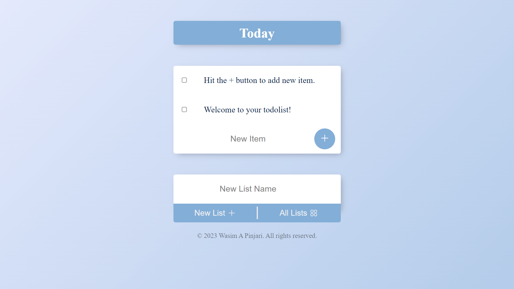

# To Do List

Demo Link: [to-do-list-app-s9p2.onrender.com](https://to-do-list-app-s9p2.onrender.com)

# Screenshot

# Features

- Implemented functionality to allow users to create, view, and delete to-do lists and list items.
- Deployed this Node/Express web app on Render.com. 
- Hosted database on the cloud using MongoDB Atlas. 
- Designed & coded the front end using HTML, CSS, JavaScript & EJS (JS templating language), and the backend database logic using the Mongoose library.